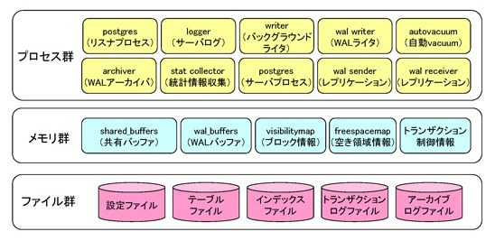
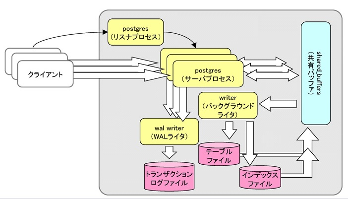
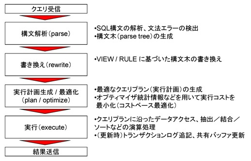

# アーキテクチャ概要

## PostgreSQLの構成要素

PostgreSQLの構成要素としては、大きくプロセスとメモリとファイルがあります。上記の図のように複数のプロセスがさまざまなメモリの領域を使って、ファイルのデータにアクセスするという構造になっています。

プロセスには、クライアントからの接続を受け付けるリスナプロセス、SQLの処理を実際に行うバックグラウンドプロセス、それ以外にもバックグラウンドライタやログを出力するロガープロセス、あとWALライタなどのプロセスがあります。

メモリには、共有バッファやWALバッファなどを始めとした、さまざまなメモリの領域があります。

ファイルは、実際のユーザデータを保持しているテーブルファイルやインデックスファイルがあります。また、トランザクションログファイル、アーカイブログファイルなどもあります。

PostgreSQLの内部では、これらが関連して動作しています。

## PostgreSQLの基本的なアーキテクチャ

図の一番右側に共有バッファと呼ばれるメモリの空間がありますが、PostgreSQLの基本的なアーキテクチャというのは、共有バッファを中心として複数のプロセッサに連携しながら処理を行うというものです。

図の右下でにあるテーブルファイルやインデックスファイルから実際のデータを読み込んで、メモリ空間である共有バッファにデータを貯めておき、そのメモリ上のデータをサーバプロセスと呼ばれる図の中央にあるいくつか複数のプロセスが共有しながら読み書きするという形になってます。

全体的なデータの流れですが、クライアントから送られたデータは、サーバプロセスによって一旦共有バッファに書き出されます。共有バッファに書かれたデータは、バックグラウンドライタを通してテーブルファイルやインデックスファイルに書き戻されることになります。ユーザによってデータベースに送信されたデータは、こういったサイクルで処理されています。

別のデータの書き出しの流れとして、WALライタがあります。WALライタは、共有バッファ中のデータに対してどのような更新をしたかという情報を「トランザクションログ」と呼ばれるログファイルに記録しておき、クラッシュリカバリの時に使用します。

以上がPostgreSQLの基本的なアーキテクチャになります。

## SQL文の処理される流れ

SQL文がPostgreSQL内部で処理される流れは上図の通りです。

ユーザが送信したクエリは、サーバプロセスによって受信された後、まずは構文解析されます。

次に書き換えが行われます。VIEWやRULEにもとづいて定型的な書き換えを実行します。

そして、実行計画（実行プラン、クエリプランとも呼ばれる）を作成し、最適化を行います。

最後にエグゼキュータで実行して結果をクライアントに返す、という流れで処理を行っています。
