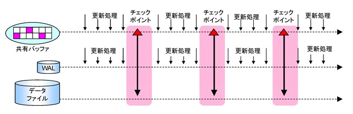

# トランザクション管理

## トランザクション処理におけるACID特性

ここではPostgreSQLのトランザクション管理について解説します。

トランザクション処理には「ACID特性、ACID属性」と呼ばれる要件があります。ACIDは、それぞれ「Atomicity、Consistency、Isolation、Durability」の頭文字を取ったもので、それぞれに備えているべき特徴があります。

* Atomicity （原子性）
    * それ以上分解できない単位の操作である
    * 「変更された」か「変更されていないか」のどちらか
* Consistency （一貫性、整合性）
    * 予め定められたルールに則った（整合性の取れた）状態である
    * 正の値しかとらない、など。
* Isolation （分離性、独立性）
    * 実行中のトランザクションが他のトランザクションに影響を与えない
    * 実行中のトランザクションの状態を参照・変更することができない
* Durability （永続性）
    * 一度コミットされたトランザクションは、何があっても残される
    * 障害が発生しても、コミットされたトランザクションの結果は残る


一つ目の「Atomicity、原子性」は、「実行されたか、実行されていないか」の状態でそれ以上分解できない単位であるということ、つまり中途半端に処理されている状態を防ぐことができる、という性質です。

その次が「Consistency、一貫性」で、あらかじめ定められたルールや制約にのっとった整合性のとれた状態である必要があるというのがこのトランザクション処理の2つ目の性質です。 

3つ目の「Isolation、分離性」というのは、実行するトランザクションが他のトランザクションに影響を与えない、 影響を与えてはいけない、という性質です。

最後の「Durability、永続性」というのは、例えばコミットしたトランザクションで金額を変更した場合、その変更内容が失われては困るので、その変更はきちんと残っていなければならない、という性質です。
 
> Durabilityについての補足。
> 
> 永続化をするといっても、現実には技術的な限界もあります。コミットしたトランザクションのログデータというのは、変更データがどのようなデバイスに存在するのか、例えばそれがローカルディスクにあるのか、ネットワークを介して大阪にあるのか、シンガポールにあるのか、いずれにせよ消失してしまう可能性があります。つまり、「何があっても残される」というのは保証できません。
> 
> そのため、実際のシステムでは、このトランザクションログを2重化するか3重化するか、あるはどのようなデバイスに書くかということが重要な問題で、あとはどのようにバックアップを取るかと、といったことが現場では必要になる技術的な知識になります。

## 各レコードの可視性の管理

ここで、トランザクションのACIDを実現する上で重要な要素となる、各レコードの可視性管理について説明します。

* PostgreSQLのテーブルファイルの中には、複数バージョンのタプルが存在する
* 複数のトランザクションにうまくデータを「見せる」ため
    * 詳細は、ACID属性のIsolationで
* 最初は一行、更新される度に、新しい行が追加
* 各行は、「作成したトランザクション」と「削除（更新）したトランザクション」の情報を持つ

PostgreSQLテーブルファイルの中には複数のバージョンのタプル（行、レコード）が存在します。

PostgreSQLの中では同じ行を更新したときに、違う行として書き込むという特徴があり、これがPostgreSQLでレコードをうまく管理するための1つの方法、実装になっております。

このあたりは、MySQLとかOracleとかと違う実装になっています。

なぜこのような実装になっているかというと、複数のトランザクションに対してうまく適切なタプルを見せるためです。最初はタプルが1行あるところから始まりますが、そのレコードが更新されるたびに新しいタプルが追加されるという形になります。そのため、各タプルは「作成したトランザクション」と「削除されたトランザクション」の情報を持ちます。

実際の例で見てみます。

まず最初に一行Insertをして、その後にselectとするとInsertしたレコードが見えます。

```
testdb=# INSERT INTO t1 VALUES ( 101, 'insert 1' );
INSERT 0 1
testdb=# SELECT * FROM t1;
 uid |  uname
-----+----------
 101 | insert 1
(1 row)
```

この時、実際のテーブルの中のデータを細かく見てみると、ブロックの中の状態としては、まずは1行存在していることが分かります、

```
testdb=# SELECT lp,lp_off,lp_flags,lp_len,t_xmin,t_xmax FROM heap_page_items(get_raw_page('t1', 0));
 lp | lp_off | lp_flags | lp_len | t_xmin | t_xmax
----+--------+----------+--------+--------+--------
  1 |   8152 |        1 |     37 |   1859 |      0
(1 row)
```

次にupdateすると、論理的には1行のままではあるものの、ブロックの中を見ると実際には2行ある、という状態になります。

```
testdb=# UPDATE t1 SET uname = 'update 1' WHERE uid = 101;
UPDATE 1
testdb=# SELECT lp,lp_off,lp_flags,lp_len,t_xmin,t_xmax FROM heap_page_items(get_raw_page('t1', 0));
 lp | lp_off | lp_flags | lp_len | t_xmin | t_xmax
----+--------+----------+--------+--------+--------
  1 |   8152 |        1 |     37 |   1859 |   1860
  2 |   8112 |        1 |     37 |   1860 |      0
(2 rows)
```

複数のタプルを管理するために、各タプルのt_max/t_minというフラグを使って、これは削除されたタプルである、あるいはまだ削除されていないタプルである、という情報を管理しています。

```
testdb=# UPDATE t1 SET uname = 'update 2' WHERE uid = 101;
UPDATE 1
testdb=# SELECT lp,lp_off,lp_flags,lp_len,t_xmin,t_xmax FROM heap_page_items(get_raw_page('t1', 0));
 lp | lp_off | lp_flags | lp_len | t_xmin | t_xmax
----+--------+----------+--------+--------+--------
  1 |   8152 |        1 |     37 |   1859 |   1860
  2 |   8112 |        1 |     37 |   1860 |   1861
  3 |   8072 |        1 |     37 |   1861 |      0
(3 rows)

testdb=#
```

このように、updateするごとに1行、1行、物理的に増えていくというのがPostgreSQLの特徴になっています。


## Atomicity（原子性）の実装

* PostgreSQLにおけるAtomicityの実装
    * コミットされたデータのみを処理対象とすることで原子性を実現
    * アボートされたデータもディスク上には存在するが無視される
    * 各タプルヘッダの情報によって「コミットされた状態かどうか」を判断
* 重要なのは以下の二つ
    * 各タプルごとの可視性情報
        * HeapTupleFields 構造体 の t_xmin, t_xmax メンバー
        * HeapTupleHeader 構造体の t_infomask メンバー
    * コミットログによるトランザクションの状態情報
        * 4つの状態定義：IN_PROGRESS, COMITTED, ABORTED, SUB_COMMITTED @ clog.h
        * TransactionIdGetCommitLSN() → TransactionIdGetStatus()

次に、PostgreSQLにおけるAtomicityの実装について説明します。

PostgreSQLでは、コミットされたデータのみを処理対象とすることで原子性を実現しています。アボートされたトランザクションのデータもディスク上には存在しますが、これらは無視されます。

各レコード（タプル）のヘッダの部分でコミットされた状態かどうかという情報を持っています。

ここで重要なのは「各タプルごとに可視性の情報を持っている」ということと「コミットログによるトランザクションの状態情報」という点です。

先ほど可視性の説明の際にも触れましたが、各レコードのヘッダ部分に、この行は生きてますよ、とか、もう削除されましたよ、という情報を保持しています。

また、PostgreSQLではコミットログと呼ばれるログを持っており、このログではトランザクションがまだ実行中なのか、それともコミットされたのか、あるいはアボートしたのか、といった4つの状態の定義を保持しています。

これらの情報によって、テーブルから読みだした行が、本当にコミットされたトランザクションのものなのか、あるいはアボートされたトランザクションのものなのか、といった状態を読み取りつつ、この行は本当にユーザに返すべき（＝見せるべき）行なのか、あるいは無視すべき（＝見せてはならない）行なのか、といった判断がPostgreSQLの内部では行われています。

このようなしくみを使って、データベースを使うユーザに対して論理的な整合性を保ちつつデータを提供しています。

以下は、各タプルのヘッダの構造体です。

```
typedef struct HeapTupleFields
{
        TransactionId t_xmin;           /* inserting xact ID */
        TransactionId t_xmax;           /* deleting or locking xact ID */

        union
        {
                CommandId       t_cid;   /* inserting or deleting command ID, or both */
                TransactionId t_xvac;   /* old-style VACUUM FULL xact ID */
        }                       t_field3;
} HeapTupleFields;


struct HeapTupleHeaderData
{
        union
        {
                HeapTupleFields t_heap;
                DatumTupleFields t_datum;
        }                       t_choice;

        ItemPointerData t_ctid;         /* current TID of this or newer tuple */

        /* Fields below here must match MinimalTupleData! */
        uint16          t_infomask2;    /* number of attributes + various flags */
        uint16          t_infomask;             /* various flag bits, see below */
        uint8           t_hoff;                 /* sizeof header incl. bitmap, padding */

        /* ^ - 23 bytes - ^ */
        bits8           t_bits[1];              /* bitmap of NULLs -- VARIABLE LENGTH */

        /* MORE DATA FOLLOWS AT END OF STRUCT */
};
```


## Consistency（一貫性）の実装

* PostgreSQLにおけるConsistencyの実装
    * ステートメント実行時に各種制約がチェックされる
    * コミット時まで遅延される制約もあり、コミット時にチェックされる
    * SET CONSTRAINTS { DEFERRED | IMMEDIATE } で変更可能
    * いずれにせよコミット完了時には制約に整合していることを保証
* 制約の評価の遅延実行
    * 遅延設定 AfterTriggerSetState() @ utility.c
    * 遅延実行 AfterTriggerFireDeferred() @ xact.c

次は、Consistency、一貫性の実装についてです。

データベースでは、各データがどういった論理の状態であるか、例えば、これとこれを足したらこういう状態であるべきであるとか、このカラムはこの値しか入ってはいけない、あるいは、このテーブルのこの値はこっちのテーブルのこの値とイコールである必要がある、など、そのような論理的な制約の実現して、その一貫性をもつ必要があります。

PostgreSQLでは制約の評価という形で実現しており、データが特定の制約を満たす必要がある場合、（遅くとも）コミットするときにそういった論理的な制約をチェックしてコミット処理をしています。

コミット時に論理的な制約を取れないような操作を行うトランザクションは、そのコミット自体ができないのでアボートされることになります。つまり、一貫性を崩すような変更はコミットできない、ということになります。

PostgreSQLでは、このようにしてデータベースの一貫性が保たれるというような実装になっています。

興味がある方は、関連するソースコードの関数やヘッダファイルを参照してください。

## Isolation（分離性）の実装

* PostgreSQLにおけるIsolationの実装
    * MVCC (Multi-Version Concurrency Control)
    * Snapshotによるトランザクションの世代管理 （snapshot.h）
    * 実装はXIDとCommandIdによるトランザクションの世代管理
* “Snapshot” とは
    * トランザクションごとに生成
    * 何が見えて何が見えないのかという可視性の管理情報
* Visibilityはトランザクションの分離レベルによっても変わる
    * PostgreSQLでの実装は3つのレベル
    * Read Committed、Repeatable Read、Serializable

PostgreSQLにおけるIsolationの実装については、MVCCを実現していますということと、Snapshotによるトランザクションの世代管理をしている、という特徴があります。

Snapshotというのは内部でトランザクションの管理に使うデータ構造で、トランザクションを開始する時に作成され、どのタイミングでトランザクションが始まったかという情報を保持しています。

このSnapshotを使うことによって、そのトランザクションでどの行が見えるべきか、あるいはどの行が見えてはいけないのかという可視性の判断を実現することができることになります。

## トランザクション分離レベルの定義

* Read Uncommitted
    * 他のトランザクションがコミットしていない内容が見える （Dirty Read）
* Read Committed
    * 他のトランザクションがコミットしていない内容は見えない
    * 他のトランザクションがコミットした変更が途中から見える （Unrepeatable Read)
* Repeatable Read
    * 他のトランザクションがコミットしていない内容は見えない
    * 他のトランザクションがコミットした変更は見えない
    * 他のトランザクションがコミットした追加・削除が見える（Phantom Read）
        * 但し、PostgreSQLの実装では発生しない
* Serializable
    * 他のトランザクションがコミットしていない内容は見えない
    * 他のトランザクションがコミットした変更は見えない
    * 他のトランザクションがコミットした追加・削除が見えない

行の可視性、その行が見えるべきかどうかというトランザクションの分離レベルによっても少しずつ変わってきます。トランザクションの分離レベルには Read Committed、Repeatable Read、Serializabelなどがあります。

分離レベルには、他のトランザクションがコミットしたデータだったら見えてもいいとか、他のトランザクションがコミットしたもの見えてはならない（Serializable）、といった、いくつかのレベルがあります。

なぜ複数のレベルがあるかというと、厳密にすべてのトランザクションをSerialozable（直列化）するとパフォーマンスへの影響が非常に大きくなります。

そのため、トランザクション処理のパフォーマンスを改善するために、ところどころは同時に実行してもいいよとか、コミットしたデータだったら見えても良い、といったように、少しずつ制約を緩くしてる、つまり他のトランザクションへの影響を許容しているのがこのトランザクションの分離レベルの定義になります。

> 分離レベルの補足。
> 
> Read CommittedのトランザクションとSerializableのトランザクションが同時に実行されて、両方が同じレコードを更新しようとした場合、どちらが先に実行されるかによっても動作が変わりますが、片方のトランザクションが他方のトランザクションがコミットされるのを待つ、といった状態が発生することがあります。
> 
> 興味のある方は実際に試してみてください。

以下は、Snapshotのデータの構造体です。トランザクション関連のxmaxとかxminのような時間やタイミングを表すデータがその内部に含まれています。

```
typedef struct SnapshotData
{
        SnapshotSatisfiesFunc satisfies;        /* tuple test function */

        /*
         * The remaining fields are used only for MVCC snapshots, and are normally
         * just zeroes in special snapshots.  (But xmin and xmax are used
         * specially by HeapTupleSatisfiesDirty.)
         *
         * An MVCC snapshot can never see the effects of XIDs >= xmax. It can see
         * the effects of all older XIDs except those listed in the snapshot. xmin
         * is stored as an optimization to avoid needing to search the XID arrays
         * for most tuples.
         */
        TransactionId xmin;                     /* all XID < xmin are visible to me */
        TransactionId xmax;                     /* all XID >= xmax are invisible to me */
        TransactionId *xip;                     /* array of xact IDs in progress */
        uint32          xcnt;                   /* # of xact ids in xip[] */
        /* note: all ids in xip[] satisfy xmin <= xip[i] < xmax */
        int32           subxcnt;                /* # of xact ids in subxip[] */
        TransactionId *subxip;          /* array of subxact IDs in progress */
        bool            suboverflowed;  /* has the subxip array overflowed? */
        bool            takenDuringRecovery;    /* recovery-shaped snapshot? */
        bool            copied;                 /* false if it's a static snapshot */

        /*
         * note: all ids in subxip[] are >= xmin, but we don't bother filtering
         * out any that are >= xmax
         */
        CommandId       curcid;                 /* in my xact, CID < curcid are visible */
        uint32          active_count;   /* refcount on ActiveSnapshot stack */
        uint32          regd_count;             /* refcount on RegisteredSnapshotList */
} SnapshotData;
```


## Durability（永続性）の実装

* PostgreSQLにおけるDurabilityの実装
    * チェックポイントにおけるデータファイルへの更新
    * コミットにおけるWAL（トランザクションログ）への同期書き込み

* チェックポイント
    * 共有メモリ上のデータをディスクに一括して反映する処理
    * CreateCheckpoint() @ xlog.c
* WAL同期書き込み
    * WALファイルは同期書き込みモードでオープン
    * XLogFlush() @ xlog.c

最後にDurability、永続性の実装について。

PostgreSQLでは、「チェックポイント」と「コミット時におけるトランザクションログへの書き込み」という機能が実装されており、この2つによって永続性が実現されています。

チェックポイントというのは後述しますが、共有メモリのデータをディスクに一括して反映する処理で、RDBMSによって非常に重要な処理です。

> 永続性についての補足。
> 
> MySQLのInnodbでは、[doublewrite](https://dev.mysql.com/doc/refman/5.5/en/innodb-disk-io.html) という方法を使って永続性を担保しています。
> 
> これは、テーブルなどのデータブロックを変更する前に、一旦 [doublewrite buffer](https://dev.mysql.com/doc/refman/5.5/en/glossary.html#glos_doublewrite_buffer) と呼ばれるテーブルスペース内の領域にデータを（時系列/continuousに）書き出し、その後に改めてテーブルのデータを変更する処理です。
> 
> これは、PostgreSQLのトランザクションログ相当の処理をInnodb内で完結させているのと同等の処理と考えることができるでしょう。

## チェックポイント

* チェックポイントとは
    * 共有バッファの内容がディスクに反映されていることを保証する地点。
    * クラッシュリカバリの開始点として使われる。
* チェックポイントにおける処理
    * 共有バッファ内の変更されているページ（dirtyページ）をディスクに一括して書き戻す。
    * ディスクI/Oとしてはランダム（テーブルやインデックスの必要なブロックのみ）かつ同期書き込みなので時間がかかる。



共有バッファの中身を一定のタイミングでディスクに書き出すのがチェックポイントの処理になります。

先に説明した通り、通常は共有バッファ上のデータを読み書きしているわけですが、メモリの内容というのはクラッシュすると消えてしまいます。そのため、データの永続性を実現するために、チェックポイントの処理によって一定の周期でディスクに書き出す、ということをしています。

例えば、上記の図の一番右端のタイミングでクラッシュした場合を考えてみます。

チェックポイントのしくみ上、クラッシュした直前のチェックポイントまではディスクにデータが保存されていることが保証されています。

そのため、直前のチェックポイントまで戻った上で、そのチェックポイント以降のトランザクションログを取り出してきて最新の状態までリカバリを実行することで、データのリカバリを実施します。（これをロールフォワードリカバリと言います）

> チェックポイントの補足。
> 
> PostgreSQLでは、チェックポイントが実行されると、その直後にページブロックを変更する際に（更新レコードだけではなく）ページブロック全体をトランザクションログに書き出します。これが full page write と呼ばれる処理です。
> 
> このことによって、万一クラッシュなどが発生した場合に、ページブロック全体をトランザクションログから復旧できるようにしています。
> 
> 但し、このようにページブロック全体を書き出すとトランザクションログが大きくなるため、（一貫性や永続性を実現するための技術的なトレードオフではあるものの）解決すべき課題として開発者たちには認識されています。
