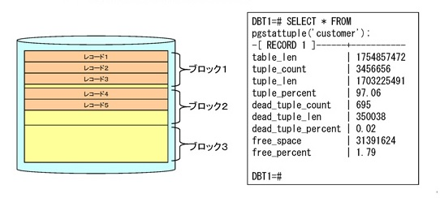
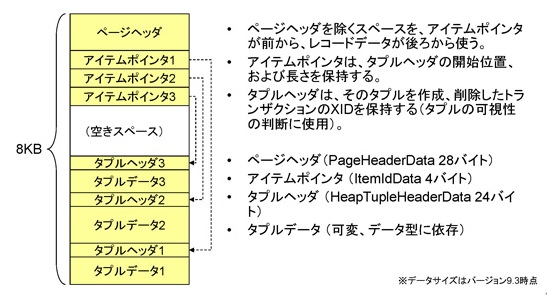
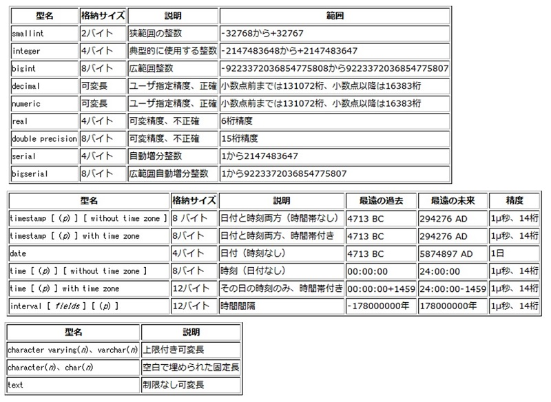
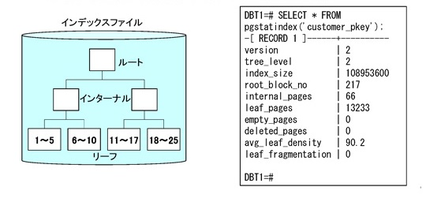
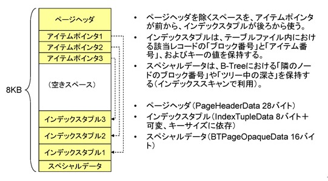
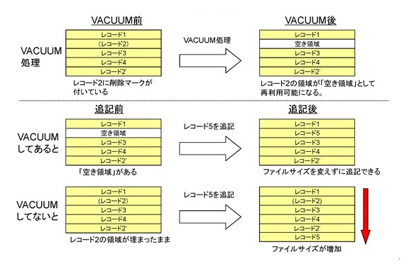
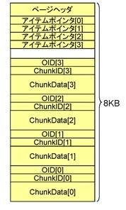
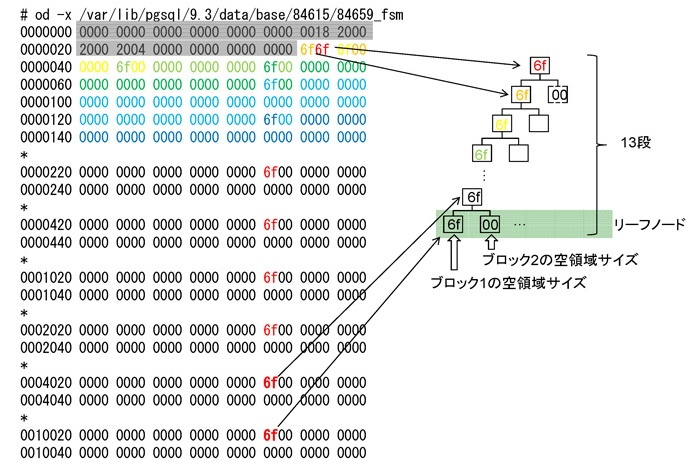
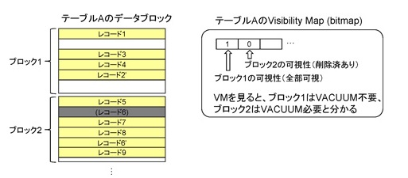

# MVCCとストレージ構造

## テーブルファイル

まず、ユーザのデータを保存するテーブルファイルとその構造について解説します。

* 8kB単位のブロック単位で構成される
* 各ブロックの中に実データのレコード（タプル）を配置
    * 基本的に追記のみ
    * 削除したら削除マークを付加する（VACUUMで回収）
    * レコード更新時は「削除＋追記」を行う。



PostgreSQLのテーブルファイルは、基本的に8kB単位のブロックで構成されています。図にありますが、全体をひとつのテーブルファイルだと考えると、その中にブロック1、ブロック2、ブロック3…というように、8kB単位で作成されています。

各ブロックの中に実データのレコード（タプル）が入っているという構造になっています。第3章でサンプルを見ながら解説しましたが、基本的には追記されるだけで、updateされる時には違うレコードとして追記していく、というしくみになっております。

右側にはテーブルの統計情報が表示されています。

tuple_countというのが行（レコード）の数で、dead_tauple_countというのは、その中で削除された行の数がどれくらいあるかという統計情報です。テーブルの中が物理的にどういう構造・状態になっているのか、ということを知るための統計情報を取ることができます。

## テーブルのページレイアウト

8kbのブロックの中がさらにどうなっているのかというのが、以下の図です。

* テーブルファイルのページブロックは、ページヘッダ、アイテムポインタ、タプルヘッダ、およびタプルデータで構成される。



この8kbのブロックの中にページヘッダと呼ばれる管理情報を持つ領域があります。

次にアイテムポインタと呼ばれる、実際のユーザのデータがブロック内のどこに存在しているのかを表す「ラインポインタ」を持っています。そして、実際のユーザのデータは、ブロックの空き領域を後ろの方から使って保存されていきます。

つまり、このブロックの中からユーザのデータを読むには、(1)このブロックを読み込んで、(2)アイテムポインタを見て、(3)アイテムポインタの指している先のタプルを読み込んで、(4)さらにタプルのヘッダを読んで、(5)最後にタプルデータを読むという処理によって、実際のユーザのデータを取り出せるという流れになります。

ページヘッダを除く空きスペースを、アイテムポインタが前方から、レコードのデータが後方から使用します。ページヘッダが28バイト、アイテムポインタが4バイト、といったサイズで定義されていますので、レコードを保存するのに使えるブロック内の領域は限られてきます。

また、当然ながらタプルのデータ、つまりユーザのデータというのは、使っているデータ型に依存して、実際にどのようなテーブル定義をしてどのようなデータを入れるかによって、実際のタプルのサイズは変わってきます。

## データ型とデータサイズ



上記はマニュアルからの抜粋ですが、データの型とサイズについては、smallintは2バイト、integerは4バイト、bigintを使うと8バイトというように、テーブルの定義、カラムに使うデータ型によって、レコードのサイズが規定されます。


## インデックス（B-Tree）ファイル

* 8kB単位のブロック単位で構成される
* ブロック（8kB単位）をノードとする論理的なツリー構造を持つ
    * ルート、インターナル、リーフの各ノードから構成
    * ルートノードから辿っていく
    * リーフノードは、インデックスのキーとレコードへのポインタを持つ



PostgreSQLのB-Treeインデックスも一般的なB-Treeの構造を取っており、「ルート、インターナル、リーフ」がある、という構造です。各ノードは8kb単位のブロックで構成されています。

一番最後であるリーフノードにはインデックスのエントリがあり、キーの値とレコードへのポイントを持っています。

## B-Tree（リーフ）のページレイアウト

* B-Treeインデックスのリーフページブロックは、ページヘッダ、アイテムポインタ、インデックスタプルで構成される。



B-Treeのページのレイアウトもテーブルのブロックと同じように、ページヘッダがあり、空き領域の後ろの方からデータが保存され、前の方はアイテムポインタが使うという構造になっています。


## VACUUM処理

レコードのUPDATEをすると、論理的には1行なんだけれど、PostgreSQLの内部では物理的には複数行ある、という話をしてきました。



上記の図の左上は、「レコード2」を「レコード2’」として更新したときに、物理的には前のレコードが残っていて、かつ新しいレコードがある、という状態を示しています。

PostgreSQLの中では、自動的にVACUUMという処理が走っていて、その処理が走ると、昔削除した古いレコードで、もう不要な領域が空き領域として管理されるようになります。

その空き領域として管理されるようになると、その領域が再度使えるようになり、異なるレコード（例えばレコード5）を追記するときには、その空き領域を使えます。

逆に、VACUUMによって空き領域として開放されていないと、まだ古いレコードで埋まっているので、空き領域を使えずにファイルの末尾に追記する必要があり、追記に伴ってファイルサイズが大きくなってしまうことになります。

ですので、PostgreSQLがこの追記型のストレージの構造を持っているというのは、ある意味において「アーキテクチャしてのトレードオフ」をそこに設定しているということになります。そのため、不要になった後にVACUUMで領域を回収することでパフォーマンスを維持する、それ以外にもVACUUMの問題をどうにか回避しよう、という工夫が、PostgreSQL内部にはいろいろと実装されています。

## インデックスとタプルの可視性

1. PostgreSQLでは、可視性情報をレコードタプルに持つ
    1. インデックスエントリは、可視性情報を持たない
    1. インデックスエントリが存在しても、レコード本体が「削除済」になっている可能性がある
1. よって、インデックス経由でレコードを取り出す場合、「インデックスエントリがある→レコード本体が生きてる」という確認処理が行われる
1. つまり、インデックスのブロックと、テーブルのブロックの両方に必ずアクセスが発生する

PostgreSQLでは、レコードごとに可視性を判断する情報を持っているという解説をしてきました。あるトランザクションに対してレコードを見せるべきか見せないべきか、あるいはVACUUMをする時に生きてるか死んでるかを判断するための情報はテーブル内のレコードに持っています。

逆に、インデックスの側にはそういった情報を持っていません。

そのため、例えば「ユーザID = 100」というインデックスのエントリが存在していたとしても、テーブルの方のレコードを見てみると、「ユーザID = 100」というレコードはすでに削除された後である、という事象が発生し得ます。

そのため、インデックス経由でレコードを読む場合には、(1)インデックスエントリがあることを確認した後に、(2)該当するレコード本体がまだ生きているかどうかを確認する、という流れになります。

よって、インデックスのブロックにアクセスして、その後テーブルのブロックにアクセスしなければならなくなりますので、この仕組みはオーバーヘッドになるのではないか、という議論もあります。そのため、この問題を克服するために、PostgreSQLでは内部でいくつか工夫が実装されています。


## TOASTテーブル

PostgreSQLでは、8kbのブロックに収まりきらないような大きなデータを管理するための手法として「TOAST」という呼ばれる機能が実装されています。

1. The Oversized-Attribute Storage Technique
    1. 長い値（約2kb以上）を、通常のテーブルのブロックではなく、専用の外部テーブルに持たせる機能
1. toast_save_datum() @ tuptoaster.c
    1. TOAST対象の値にOIDを付与
    1. 約2kbのチャンクに分割して、チャンク番号を付与
    1. 1ブロックに最大4チャンクを格納
1. 例えば、7kbのテキストをTOASTする場合
    1. テキストの値に OID （例えば12345）を付与
    1. 2kB, 2kB, 2kB, 1kBの4チャンクに分割
    1. チャンク番号を0, 1, 2, 3と付与する
    1. TOASTテーブルに書き込む
    1. 元テーブルのフィールドに位置情報を保存
        1.varatt_external型



TOASTでは、大きなデータ（通常は2kb以上）を通常のテーブルのブロックではなく、専用の外部テーブルに格納する方式を取ります。その際、データにOIDを付与して2kbにチャンクに分割、それぞれのチャンクにチャンク番号を付与して、1ブロックに最大4チャンクを保存する、という処理を行っています。

例えば7kbのテキストをテーブルに入れようとした場合には、そのテキストの値にまずOID、例えば12345のような値を付与して、その後に2kb、2kb、2kb、1kbの4つチャンクに分割します。それぞれのチャンクにチャンク番号0、1、2、3と付与して、それを2kbずつTOASTテーブルに書き込みます。

このようにして、長いデータ（text、byteaやblobなど）はこのような仕組みで管理されているのがPostgreSQLの特徴です。

以下はTOAST対象となるデータを内部で持つ時のデータ構造です。

```
struct varatt_external
{
        int32           va_rawsize;             /* Original data size (includes header) */
        int32           va_extsize;             /* External saved size (doesn't) */
        Oid             va_valueid;             /* Unique ID of value within TOAST table */
        Oid             va_toastrelid;          /* RelID of TOAST table containing it */
};
```

可変長のデータは上記のように、もともとのサイズ（va_rawsize）と外部のサイズ（va_extsize）、TOASTテーブル（外部テーブル）内でのOID（va_valueid）と、TOASTテーブルそのもののOID（va_toastrelid）が設定されて、元のテーブルの方に、このように「外部のどのテーブルのどこに保存されたのか、どれくらいのサイズなのか」という情報が保存されるようになっています。


## FreeSpace Map (FSM)

データベース内ではブロックがたくさん作成されるわけですが、ではそのブロックにどれくらいの空き領域があるのか、今どこのブロックにどれくらい書き込めるのか、といった情報を内部で管理しておく必要があります。

例えば、400bytesのデータをINSERTしたい時に、その400bytesのデータを実際にどこのブロックに書き込めますか、というような空き領域の管理をしているのがFreeSpace Mapという機能です。

1. 各ページの空き領域情報を管理するためのファイル
    1. タプルを格納する空き領域のあるページを見つける
    1. 空き領域のあるページがもう無いことを確認する
1. 各テーブル／インデックスファイルごとに存在
    1. 拡張子 “_fsm” のファイル（リレーションの “fork” と呼ばれる）
    1. ブロックごとに1バイトを使って、空き領域を BLCKSZ/256 で割った値を保持
        1. FSM value = Free space / ( BLCKSZ / 256 )
    1. 例）1024bytesの空き領域がある場合、1024/ (8192/256) = 32 を記録
        1. Free space = FSM value * ( BLCKSZ / 256 )
        1. FSM value 0~255 で空き領域 0~8160 bytes を表現可能
1. 各ページ内に8158個のノードを持つバイナリツリー構造
    1. 4095のNonLeafと、4063のLeaf （topとleafを含めて13段のツリー）

これはタプルを格納する空き領域があるページを見つけるための機能で、必要とするサイズの空き領域のあるページを見つけるか、あるいは空き領域があるページがもうない、つまりどのページにも書き込めないので新しくブロックを1個増やさないといけない、などといった判断をするために使われます。

各テーブルファイルやインデックスファイルごとに存在していて、<拡張子_fsm> という名前のついたファイルになります。

FSMでは、それぞれのブロックごとに上記の計算式でFSMの値を出して、それを格納しています。空き領域、Freespaceを「ブロックサイズ÷256」という値を「FSMの値」として持っています。逆にその値を使えば、そのブロックにどれくらいの空き領域があるかを逆算できます。


## FSMの物理レイアウト

実際のFSMはdumpを取ると以下のようなの物理レイアウトになっています。



グレーアウトされている部分はページヘッダです。

それ以降は「6f」というデータがありますが、全体は2分木で構成されていて、直下の2つのリーフのうち、大きい空き領域のある方を記憶している、という構造になっています。

ツリー構造は全部で13段あり、ツリーの下の方でも「6f」という値がFSMの値として保持されています。

他のところはほとんど0になっていますが、これはこのテーブルに1ブロックしか存在していなかった時の状況です。

## Visibility Map (VM)

PostgreSQLには、Visibility Mapという機能があり、このVisibility Mapは、VACUUMするときに本当にVACUUMする必要があるかどうかを判断するために、あるいはインデックスを読んだ際にテーブルのレコード本体を読みに行く必要があるかどうか、といった判断をする際に参照されるデータです。

1. 各ブロックのレコードの可視性状態を保持するファイル
    1. 「削除された行があるかどうか」をビットマップで保持
    1. 拡張子 “_vm” のファイル（リレーションの “fork” と呼ばれる）
    1. そのブロックをVACUUMする必要があるかどうかの判断
    1. Index-Only Scan（レコード本体を見ない）できるかどうかの判断
1. ビットが立っていると、ブロック内の全タプルが全トランザクションに可視
    1. つまり、VACUUMする必要がない
    1. 加えて、テーブルファイルにアクセスしなくても、タプルがすべて生きていることが分かる（Index-Only Scan）
    1. visibilitymap_test() @ visibilitymap.c
1. タプルを操作した際に、ビットを操作する
    1. visibilitymap_clear() @ visibilitymap.c
    1. visibilitymap_set() @ visibilitymap.c

各ブロックのレコードの可視状態がどうなっているかというのを保持するファイルで、ブロックの中に削除されたレコードがあるかどうかの情報をビットマップで保持しています。つまり、0/1でこのブロックの状態を管理しています。

Visibility Mapは、そのブロックをVACUUMをする必要があるかどうかの判断をするために参照する、あるいは（Index-Only Scanと呼ばれる処理ですが）インデックスアクセスの際にテーブル本体のレコードの可視性を確認しなくて済むかどうかを判断するために参照する、そのためのフラグとしてビットマップを持っています。


## Visibility Mapの構造

以下はVisibility Mapの構造です。

1. テーブルのブロックとVMの関係
    1. ブロック1は全レコード可視、ブロック2はレコード6が削除（更新）済み
    1. VACUUM時に、ブロック1の処理は飛ばす
    1. Index-Only Scanの時に、ブロック1のタプルはすべて存在と分かる



以下で、テーブルのブロックとVisibilityの関係を見てみます。

例えば、ブロック1とブロック2がある場合に、ブロック1の方はレコードがすべて生きていて、ブロック2の方は1行だけ削除されている状態を考えてみます。

ブロック1の中に「1、3、4、2’」というレコードが存在していて、どれもまだ削除されてないとします。また、ブロック2の方は、「5、6、7、8、9」というレコードがありますが、レコード6というのが6'として更新されていて、古いレコード「6」は削除済み、という状態を考えてみます。

そのときにVisibility Mapがどういうデータをもっているかというと、ブロック1の可視性について、すべてのレコードが可視の場合には1を持ちます。このブロックの中のレコードが全部生きている、という情報を持っています。

こちらの2つ目のブロックは、すでに1レコードが削除されてるので、可視性のフラグが0になっていて、このブロックの中には削除された行がある、というステータスがここで保持されています。
