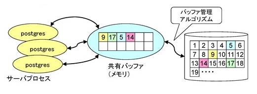

# メモリ管理

## 共有メモリとローカルヒープ

* 共有メモリ
    * 複数のバックエンドで共有されるデータを保持する
    * セッション（バックエンド）をまたいで共有すべきデータ
    * 共有バッファ、トランザクション情報、ロック情報、等
    * サービス起動時に固定サイズを確保する
        * CreateSharedMemoryAndSemaphores() @ ipci.c
* ローカルヒープ
    * 個別のセッション（バックエンド）で使用するメモリ
    * ソート、演算処理などを実行する時に使用するメモリスペース
    * 必要となる度に確保、不要になったら開放
        * palloc(), pfree() @ mcxt.c

PostgreSQLのメモリ管理について、PostgreSQLの中で使われるメモリには大きく分けて「共有メモリ」と「ローカルヒープ」という領域があります。

第1章で「共有バッファ」というキーワードがでてきましたが、アーキテクチャの図の一番右の方にあったメモリが「共有メモリ」と呼ばれるメモリ空間です。複数のバックエンドで共有させてデータを保持します。つまり、セッション間をまたいで共有すべきデータを保持しているということです。

共有バッファやトランザクションの情報、誰がどういうロックを保持しているのか、というようなロックの情報もここの領域で保持しています。

この共有メモリは、PostgreSQLのサービスを起動する時に固定のサイズを確保するようになっており、内部では CreateSharedMemoryAndSemaphores() という関数で、共有メモリの確保が行われています。

一方で、ローカルヒープというのは、個別のセッションでバックエンドが使用するメモリです。例えばソートや演算処理に使うメモリ空間は他のバックエンドと共有する必要はないので、このローカルヒープを使って実行します。必要となるたびに確保して、不要になったら開放します。PostgreSQLの内部で使うためのインターフェースとして、palloc()やpfree()といった、malloc()/free()と同じような実装がされています。


## Memory Context

* フラットなメモリ空間に構造を導入する
    * メモリコンテキスト単位で確保・破棄する（メモリリークを防止）
    * コンテキストの中から palloc() で確保して使用する
    * メモリのセグメンテーションを防止する
    * メモリコンテキストは用途によって切り替えて使う
        * TopMemoryContext （すべてのコンテキストの親）
        * TopTransactionContext （トランザクションのコンテキスト。COMMIT/ROLLBACKまで生存）、等
    * 親コンテキストを破棄すると、子コンテキストも再帰的に破棄される
* メモリコンテキスト操作 @ mcxt.c
    * MemoryContextInit()
    * MemoryContextCreate()
    * MemoryContextSwitchTo()
    * MemoryContextAlloc()
    * MemoryContextDelete()

もう1つのPostgreSQLの特徴的なメモリの管理として、「メモリコンテキスト（Memory Context）」という機能があります。

Unixの場合、メモリ空間はフラットな空間になっていますが、そのフラットなメモリ空間の中に構造を導入するのが、このメモリコンテキストと呼ばれる機能です。

メモリコンテキストが実現する特徴として、メモリコンテキスト単位で確保したり破棄したりすることでメモリリークを防止する、という機能があります。つまり、先ほどのpalloc()やpfree()をする際に、対象となるメモリコンテキストを決めるわけですが、そのコンテキストを破棄することによって、pfree()を呼ばなくても強制的にメモリを解放することができる、というのがメモリコンテキストの特徴の一点目になります。

また、コンテキストの中でpallocで確保して使用することになりますので、メモリのセグメンテーションを防止する、ある程度局所化するということを実現することができるようになります。

メモリコンテキストはその用途によって切り替えて使うことになります。TopMemoryContextやTopTransactionContextといったコンテキストが用途によって何種類かありますが、これらをうまく切り替えてpalloc()しながら使う、そして不要になったら全部まとめてコンテキストごと破棄する、というような使い方をすることになります。

メモリコンテキストを操作する関数としては、mcxt.cというファイルの中で、MemoryContextInit()、MemoryContextCreate()、MemoryContextSwitchTo()や、MemoryContextAlloc()という関数があります。これらの関数を見ると、実際にメモリコンテキストをどのように管理しているか、ということが分かります。

以下は、メモリコンテキストに関連するMemoryContext構造体とそのアクセスメソッドMemoryContextMethods構造体の定義です。

MemoryContext構造体の中には、parentっていう要素があり、これがそのコンテキストの親コンテキストを示しています。その下にfirstchildとかnextchildとかというツリー構造を実現するメンバ変数があって、これらを使って複数のコンテキストの構造を管理する、というのがこのメモリコンテキストの基本的なしくみになります。

```
typedef struct MemoryContextData
{
        NodeTag         type;                   /* identifies exact kind of context */
        MemoryContextMethods *methods;          /* virtual function table */
        MemoryContext parent;           /* NULL if no parent (toplevel context) */
        MemoryContext firstchild;       /* head of linked list of children */
        MemoryContext nextchild;        /* next child of same parent */
        char       *name;                       /* context name (just for debugging) */
        bool            isReset;                /* T = no space alloced since last reset */
} MemoryContextData;

typedef struct MemoryContextMethods
{
        void       *(*alloc) (MemoryContext context, Size size);
        /* call this free_p in case someone #define's free() */
        void            (*free_p) (MemoryContext context, void *pointer);
        void       *(*realloc) (MemoryContext context, void *pointer, Size size);
        void            (*init) (MemoryContext context);
        void            (*reset) (MemoryContext context);
        void            (*delete_context) (MemoryContext context);
        Size            (*get_chunk_space) (MemoryContext context, void *pointer);
        bool            (*is_empty) (MemoryContext context);
        void            (*stats) (MemoryContext context, int level);
#ifdef MEMORY_CONTEXT_CHECKING
        void            (*check) (MemoryContext context);
#endif
} MemoryContextMethods;
```

## 共有バッファと管理アルゴリズム

次に、共有バッファが実際にどのように使われているのかを解説します。

* 共有バッファは、ディスク上のブロックをキャッシュする共有メモリ領域
    * ディスク上のブロックのうち、アクセスするものだけを読み込む
    * ディスクI/Oを抑えて読み書きを高速化
* すべてのサーバプロセスで共有
    * すべてのブロックはバッファに乗らないので入れ替えが発生
    * 「どのバッファを捨てるか、どのバッファをキープするか」が性能に影響
    * Buffer replacement algorithmの変遷：LRU → ARC → 2Q → Clocksweep
        * BufferAlloc() @ bufmgr.c

共有バッファはディスク上のブロックをキャッシュする共有メモリ領域のことです。

データベースでは、通常、物理メモリのサイズよりもデータそのもののサイズの方が大きくなっています。そのため、そういう状況において、限られたサイズの物理メモリをうまく使って、いかにI/O量を減らすかというのが共有バッファの持つ役割になります。



上図の例ですと、右側のテーブルのブロックの9番目とか17番目、5番目とか14番目とか、実際にアクセスする部分だけを読み込もうとしているわけですが、当然ながらすべてのブロックは物理メモリ上には載らないので、新しいブロックを読み込むときに共有バッファがもういっぱいになっていたら、読み込み済みの他のブロックを捨てないといけない、といった処理が発生します。

そのどれを捨てるかを判断するアルゴリズムのことを Buffer replacement algorithm とここでは表現していますが、LRUやARC、2Qなど、昔からいくつかアルゴリズムは変遷してきました。現在は Clocksweep と呼ばれる、時計が針を刻むようにカウントしていって捨てるものを決める、というようなアルゴリズムが使われています。このアルゴリズムの詳細は BufferAlloc() というコードの実装を見ると分かります。

なお、各バッファページに割り当てられるデータ構造は BufferDesc という構造体として定義されています。

```
typedef struct sbufdesc
{
        BufferTag       tag;                    /* ID of page contained in buffer */
        BufFlags        flags;                  /* see bit definitions above */
        uint16          usage_count;    /* usage counter for clock sweep code */
        unsigned        refcount;               /* # of backends holding pins on buffer */
        int                     wait_backend_pid;               /* backend PID of pin-count waiter */

        slock_t         buf_hdr_lock;   /* protects the above fields */

        int                     buf_id;                 /* buffer's index number (from 0) */
        int                     freeNext;               /* link in freelist chain */

        LWLockId        io_in_progress_lock;    /* to wait for I/O to complete */
        LWLockId        content_lock;   /* to lock access to buffer contents */
} BufferDesc;
```

> バッファ管理アルゴリズムの補足。
> 
> 典型的なRDBのバッファ管理のアルゴリズム（LRUなど）を単純に実装すると、大きなテーブルをスキャンすると、バッファの中身がすべて溢れてしまうことがあります。
> 
> 現在のPostgreSQLでは、大きなスキャンを行う場合には別のメモリグループを確保して、メインの共有バッファが溢れないように（中身が消えないように）うまく工夫する実装が行われています。
> 
> バッファ管理アルゴリズムが変遷してきたのは、いわゆるバッファ管理のトラディッショナルな問題をどのように解決していくか、その工夫の跡を示していると言えます。
