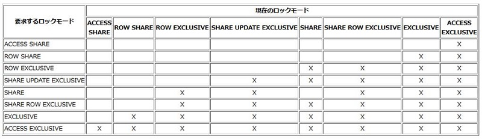
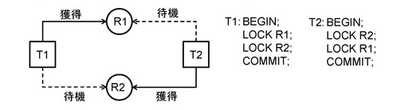

# ロック制御

## ロック

* 並行して処理を行っているRDBMSでは、データの整合性のためにリソースに対する排他制御が必須
    * データの読み取り、書き込み、その他
* ロックには、ロックレベルと粒度の概念がある
    * ロックのレベル（モード）はPostgreSQLでは8種類
    * 粒度は、テーブル、レコード、トランザクションなど

ロックとのいうは、当然データを操作する上で非常に重要にな要素です。特に並行して処理を行っているデータベースではデータの整合性を担保するためにリソースに対する排他制御は必須の機能になります。ロックすべき処理には、データの読み取りや書き込み、その他にもいろいろあります。

ロックには「レベル」と「粒度」という概念があります。

例えば、ロックのレベル、PostgreSQLではモードとも呼ばれますが、この種類は8種類くらいあります。

ACCESS SHAREという共有ロックから始まって、行の排他ロックや、その他にも、いろんなロックのモードがあります。

粒度というのは、レコード単位のロックなのか、テーブル単位のロックなのか、など、いろんな粒度のリソースを対象にロックすることができますので、この辺りの条件を組み合わせて、何に対してどのようなロックをするかということを考えていくのがPostgreSQLのロックの仕組みになります。

## 2-Phase Locking (2PL)

* ロックの獲得期、解放期の2フェーズに分類して管理
    * ロックの獲得・解放を繰り返すと、デッドロックを起こしやすくなるため

")

出典: http://www.cubrid.org/files/attach/images/220547/566/507/two-phase-lock.png

* PostgreSQLでは、トランザクションの終了までロックを保持
    * COMMIT/ROLLBACK時に一括解放
    * CommitTransaction(), AbortTransaction() @ xact.c
    * ResourceOwnerRelease() @ resowner.c

PostgreSQLでは、Two-phase lockingという仕組みを実装していて、ロックの獲得期と解放期の2フェーズに分類してロックを管理します。

なぜかというと、ロックの獲得と解放を細かく繰り返すとデットロックを起こしやすくなるためです。これは、理論的にそうなることが明らかなので、PostgreSQLではこのような形でシンプルに管理する形になっています。

PostgreSQLでは、トランザクション終了までロックを保持しておいて、最後にトランザクションをCOMMITまたはROLLBACKするときに一括してロックを解放します。よって、例えばテーブルロックを取るための「LOCK」というコマンドはありますが、逆の「UNLOCK」というコマンドはありません。一旦獲得したロックを解放するためには、トランザクションをコミットするかロールバックするかしなければなりません。

## デッドロックの検出と解消

* デッドロック
    * 複数のリソースのロックを獲得しようとする複数のセッション
    * それ以上継続することは（論理的に）できない

* ロック待機が1秒（デフォルト）を越えるとデッドロック検出ロジックが動作
    * デッドロックが見つかったら、どれかのセッションをABORTさせる
    * 残ったセッションは継続できる

デットロックとはどういうものかというと、トランザクション1とトランザクション2がある時、それぞれ違うリソースに対するロックを確保した後、相手がロックを確保しているリソースのロックを取ろうとすると、それぞれがお互いのロック解放を待ちあうデットロックとなってしまい、いつまでたっても論理的に先に進めない、という状態になります。このように、複数のセッションが複数のリソースに対するロックを獲得しようとする時に発生するものです。

PostgreSQLの場合は、ロック待機が1秒を超えるとデットロックが起こってるんじゃないか考えて、デッドロックの有無を確認するチェックが実行されます。このチェックのロジックが走った結果、デットロックが見つかると、どれかのセッションがABORTされ、残ったセッションは継続できる、ということになります。つまり、このデットロックの輪の確認が一秒に1回チェックが走り、問題があればデッドロックを破る、という処理が行われています。

そのため、ロック待機やデットロックが多く起こるような状態を引き起こすアプリケーションやトランザクションを走らせると、このデットロックのチェックのロジックのコストが高くなる、という現実があり、パフォーマンスチューニングが必要になる場合があります。

## SpinLockとLWLock

* Heavyweight Lock
    * ユーザー（DBA）から見えるロック
    * テーブルロックなどに使用。pg_locksビューから確認可能
* Lightweight Lock
    * ユーザー（DBA）から見えないロック
    * バッファのロックなど、内部的なリソースのロックに使用
* Spinlock
    * ユーザー（DBA）から見えないロック
    * CPUやメモリなどの超短時間だけ使用するロック
    * CPUやメモリ操作のAtomicityやConsistencyを担保するロック

PostgreSQLには、Heavyweight Lock、Lightweight Lock、Spinlockというように、いろんなロックのレベルがあります。

Heavyweight Lockは、ユーザやデータベースのエンジニアが明示的にとるロックで、LOCK TABLEやSELECT FOR UPDATEなどのロックがこのHeavyweight Lockに該当します。

その次がLightweight Lockで、ユーザやDBAからは見えないロックですが、共有バッファのロックなど内部的なリソースのロックに使用されるものです。

一番下のSpinlockというのは、ユーザから見えないロックですが、CPUやメモリなどを占有する際に超短時間だけ使用するロックです。CPUやメモリ操作のAtomicity（原子性）やConsistency（一貫性）を担保するための一番低いレベルのロックになります。
