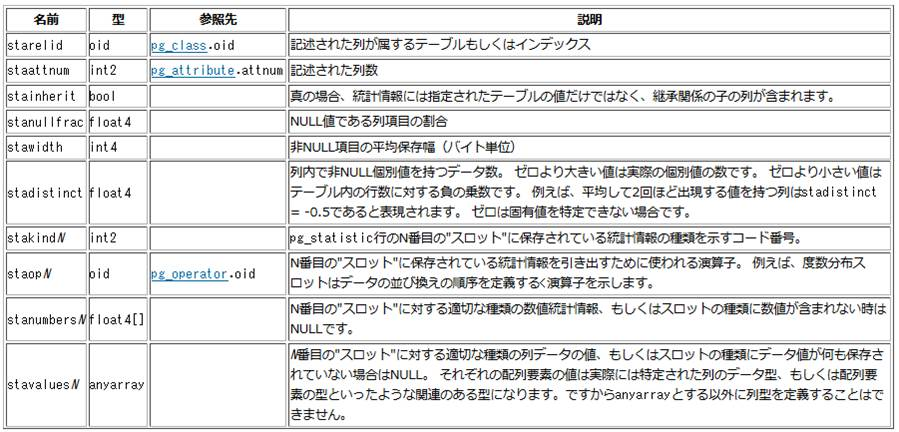
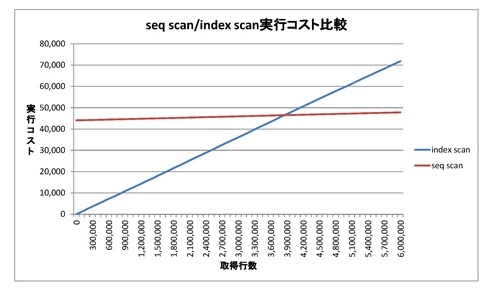

# パース、リライト、オプティマイズ

## パース、リライト

* SQLのシンタックスに基づいて構文解析を行う
    * 構文は gram.y （yacc） で定義
* パーサはSQL文を受け取り、内部構造としてのクエリツリー（Query構造体）を作成する
    * parse_analyze() @ postgres.c
    * transformSelectStmt() @ analyze.c
    * set ｄebug_print_parse = true でクエリツリーをログ出力
* ビューについてはクエリツリーのリライト（書き換え）行う
    * pg_rewrite_query() @ postgres.c
    * set debug_print_rewritten = true でリライト後のクエリツリーをログ出力
* プランナーは、クエリツリーを受け取って実行プラン（PlannedStmt構造体）を作成する
    * pg_plan_queries() @ postgres.c

パースというのは、SQLの文法（シンタックス）に基づいて構文解析を行う処理です。

パーサはSQL文を解析した上で、内部構造としてQuery構造体（PostgreSQLではクエリツリーと呼ばれます）を作成します。

PostgreSQLにはVIEWという機能があります。これはデータの実態を持つテーブルの参照方法を定義する機能ですが、PostgreSQLではクエリツリーを書き換えることによってこの機能を実現しています。VIEWというのは、特定のテーブルに対する別名の定義、別の構造の定義のような形になりますので、そこは1回作成したクエリツリーを一定のルール（VIEWの定義）に基づいて書き換えることで実現することができるわけです。

プランナーはクエリツリーを受け取って実行プランを作成します。

プランナーはクエリツリーを受け取って実行プランを作成するとありますが、これが実際にどのように行われるのか、いかに最適な実行プランを作成するかというのが、このオプティマイザと呼ばれるモジュールの役割になります。

## オプティマイザ統計情報

* テーブルやインデックスなどのカラムの値の統計
    * オプティマイザは、オプティマイザ統計情報を見て実行プランを作成
    * 統計情報が間違っていると、妥当な実行プランができない
    * ANALYZEまたはVACUUMコマンドで更新



オプティマイザはオプティマイザ統計情報という情報を見て実行計画を作ります。

オプティマイザ統計情報は、テーブルやインデックスなどのカラムの値の統計で、これはpg_statisticというシステムテーブルに統保持されてます。これを見ると特定のカラムにおけるNULL値の割合や、非NULL項目の平均保存幅、データのサイズ、データの偏りなどの情報を取得することができます。

つまり、どのテーブルからどの順番で結合するとパフォーマンスがいいのか、あるいはより効率よく絞り込めるのか、など、そういった予測をオプティマイザ統計情報を使って計算します。その上で、その中で一番効率の良い実行プランを選ぶ、というのがオプティマイザの役割になります。

そのため、この統計情報が間違っていると適切な実行プランの作成、選択ができなくなります。よって、オプティマイザ統計情報というのは、SQLのパフォーマンスを考える上で非常に重要なデータになります。

> オプティマイザ統計情報の補足。
> 
> データベース内に保持されているデータの状況は日々変わっていきますので、オプティマイザ統計情報も更新する必要があります。
> 
> PostgreSQLでは、メンテナンスのためにVACUUMコマンドが自動的に実行されていますが（自動VACUUM機能）、オプティマイザ統計情報もその時同時に更新されています。VACUUMコマンドは、テーブルの（ほぼ）全スキャンを行うことになるため、その時にテーブルの情報を収集することができるためです。VACUUMコマンドとは別に、オプティマイザ統計情報を更新するためだけのANALYZEというコマンドもあります。
> 
> オプティマイザ統計情報に実データとの相違が発生して、正しい実行プランを作成できなくなるケースとしては、新しいデータを大量に投入するケース（レコード件数0のテーブルに100万行追加するなど）、あるいは大量にデータを削除するケース（100万行あったレコードを1万行に減らすなど）などがあります。
> 
> そのような大きいデータの変動があるとオプティマイザ統計情報の更新が追いつかないため、実行プランがおかしくなってクエリの実行時間が異様に長くなる、というケースがありますので、その時にはANZLYZEコマンドをかけて、きちんとオプティマイザ統計情報を更新する必要があります。

## よく利用されるオプティマイザ統計情報

* オプティマイザ統計情報は、主にselectivityと、その結果のコストを計算するために使用される
* 非nullの値の最頻値とその割合
    * STATISTIC_KIND_MCV @ pg_statistic.h
    * ある値を指定した時に、それがどれくらい存在するのかを予測する
* カラムの値のヒストグラム
    * STATISTIC_KIND_HISTOGRAM @ pg_statistic.h
    * ある値を指定した時に、それ以上／それ以下の値がどれくらい存在するかを予測する
* 物理的な並びと論理的な並びの相関係数
    * STATISTIC_KIND_CORRELATION @ pg_statistic.h
    * 論理的にソートをする場合のコストを予測する

オプティマイザの統計情報は、主にselectivity（レコードの選択率）と実行コストを計算するために使われます。

まずは、非NULL値の最頻値とその割合です。MCV（Most Common Value）と呼ばれますが、ある値を指定した際に、その値がテーブルの中にどれくらい存在しているのかというのを予測するためにこの統計情報を使います。

次は、カラムの値のヒストグラムです。ある値を指定した時に、それ以上、あるいはそれ以下の値がどのくらい存在するかとういうのを予測するために、このヒストグラムの統計情報が使われます。

最後は、物理的な並びと論理的な並びの相関係数です。データベース内でソートをする場合に、論理的なデータの順番と物理的なデータの配置が一致しているとパフォーマンスが非常に良くなります。逆に、論理的なデータの並びとブロックの並びがきちんと相関していないと、ランダムアクセスのような状況が発生してしまいますので、実行コストが高くなり、パフォーマンスが悪化することになります。そのため、実行コストを予測する際には、そういった情報も参考にしたりします。

このようなさまざまな統計情報を使って最適な実行プランを作成するというのがPostgreSQLのオプティマイザの特徴になります。

## 実行コストの計算

* 各種コストパラメータを用いて算出する論理的な値
* 実行コストは、ディスクI/OコストとCPUコストで構成される
    * シーケンシャルスキャン時のブロック読み込みコスト	1.0
    * ランダムアクセス時のブロック読み込みコスト		4.0
    * タプル1行を読み込むCPUコスト			0.01
    * インデックス1エントリを読み込むCPUコスト		0.0025
* 各種オペレーションのコスト計算 @ costsize.c
    * cost_seqscan()
    * cost_index()
    * cost_bitmap_heap_scan()
    * cost_tidscan()
    * cost_sort()
    * cost_agg()
    * …

実行コストは、ディスクI/OとCPUコストで構成されます。

コストを算出する基礎値として、シーケンシャルスキャンのときのブロックの読み込みコストを1.0、ランダムアクセスするときのブロックの読み込みコストを4.0、タプル1行を読み込むCPUコストを0.01、インデックス1エントリを読み込むCPUコストを0.0025、のように定義されています。

オプティマイザは、テーブルからデータを取り出すときにどれくらいのブロックにどのようにアクセスするのかとか、どのくらいのレコードを取り出すのか、というのを見積もった後に、この基礎値を使って実行コストを算出して、いくつか候補として計算した中でもっとも実行コストが良い実行プランを選ぶ、というのがPostgreSQLのコストベースの実装になります。

> 実行コストの補足。
> 
> オプティマイザが実行コスト算出の際に使用する基礎値は、postgresql.confの中のプランナコスト定数のパラメータとして定義されており、上記の値はデフォルト値です。そのため、自分で変更することも可能です。
> 
> 例えば、ストレージをフラッシュデバイスにした場合に、ランダムアクセスでもコストは1.0で良いのではないか、という考え方もあります。

以下は、シーケンシャルのコストを計算する部分のコードです。

```
void cost_seqscan(Path *path, PlannerInfo *root,
                  RelOptInfo *baserel, ParamPathInfo *param_info)
{
        Cost            startup_cost = 0;
        Cost            run_cost = 0;
        double          spc_seq_page_cost;
        QualCost        qpqual_cost;
        Cost            cpu_per_tuple;

        /* 予測されるテーブルの行数を取得する */
        if (param_info)
                path->rows = param_info->ppi_rows;
        else
                path->rows = baserel->rows;

        if (!enable_seqscan)
                startup_cost += disable_cost;

        /* シーケンシャルスキャン時の1ページ読み込みコストを取得 */
        get_tablespace_page_costs(baserel->reltablespace, NULL, &spc_seq_page_cost);

        /* ディスクI/Oコスト = シーケンシャルスキャンコスト * ページ数 */
        run_cost += spc_seq_page_cost * baserel->pages;

        /* CPUコスト = タプル読み込みコスト * 取り出しタプル数 */
        get_restriction_qual_cost(root, baserel, param_info, &qpqual_cost);

        startup_cost += qpqual_cost.startup;
        cpu_per_tuple = cpu_tuple_cost + qpqual_cost.per_tuple;
        run_cost += cpu_per_tuple * baserel->tuples;

        path->startup_cost = startup_cost;
        path->total_cost = startup_cost + run_cost;
}
```

コスト計算の手順としては、最初に予測されるページの行数を取得し、そのときにシーケンシャルスキャンの1ページの読み込むコストを取得し、ディスクのI/Oのコストを出ます。次に、CPUコストを計算して、それを全部足しあわせて、最後に合計のコストを取得する、という処理になっています。

これは cost_seqscan() という関数ですので、シーケンシャルスキャンのコストを計算しているというロジックであることが分かります。

## Seq scan/Index scan実行コスト例

以下は、インデックススキャンとテーブルスキャンのコストがどのように違ってくるかを理解できる例です。

* select count(*) from orders where o_orderkey < $i;



上の図は、600万行あるテーブルの中からレコードを取り出す時に、少しずつレコード数を増やしていくと実行コストがどのように変わるかを図にしてものです。横軸が取り出すレコード数、縦軸が実行コストを表しています。

シーケンシャルスキャンの場合は、取り出すレコードが何件かに関わらずテーブルをすべてスキャンするという処理ですので、何行取り出してもほとんど変わりません。

一方で、インデックスアクセスの場合は、取り出すレコード数が少ない時（＝selectivityが高い時）は実行コストが低くなります。ただし、取り出す行数が増えていく（＝selectivityが下がってくる）と実行コストが上がっていって、ある時点でシーケンシャルスキャンとインデックススキャンの実行コストが逆転します。

よって、ここの交差するポイントを超えると、インデックススキャンよりもシーケンシャルスキャンを使った方が実行コストが低いのである、ということをオプティマイザが判断して、インデックススキャンではなくシーケンシャルスキャンを使う実行プランを作成する、というのがオプティマイザの役割になります。


## GEQO（遺伝的問い合わせ最適化）

* 結合するテーブルが増えると、組み合わせのパターンが増加する
    * テーブルがnの場合の組み合わせのパターン：n!
* 結合処理を行うテーブルが多くなった場合、PostgreSQLではGEQOというオプティマイザが実行される
* 遺伝的アルゴリズムを用いた最適化処理

PostgreSQLには、CEQO（遺伝的問い合わせ最適化）というオプティマイザの機能があります。

SQLでJOINの処理を行う場合、使用するテーブルが増えていくと、実行プランを作成する際に試さなければならない組み合わせのパターンが爆発的に増えていきます。そうなると、オプティマイザの処理がどんどん重くなります。

そのため、結合処理を行うテーブルを多くなった時には、PostgreSQLではGEQOというオプティマイザが実行されます。

これは遺伝的アルゴリズム（GA）を使ってJOINの組み合わせ爆発の問題を避けるテクニックで、このような工夫を用いて、計算量を抑えながらより良い実行プランを早く見つける、ということをPostgreSQLのオプティマイザは行っています。

## 参考資料

* 問合せ最適化インサイド http://www.slideshare.net/ItagakiTakahiro/ss-4656848
* より深く知るオプティマイザとそのチューニング http://www.slideshare.net/hayamiz/ss-42415350
* PostgreSQL：行数推定を読み解く/row-estimation https://speakerdeck.com/kyabatalian/row-estimation
* Beyond EXPLAIN: Query Optimization From Theory To Code http://pt.slideshare.net/hayamiz/beyond-explain-query-optimization-from-theory-to-code
