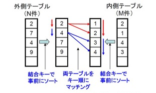
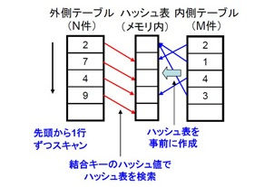
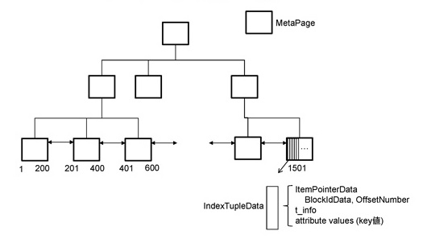
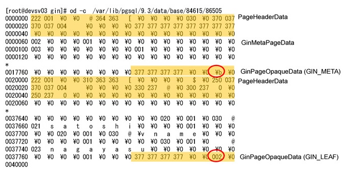

# エグゼキュータ

## エグゼキュータの役割

* テーブルスキャン
* インデックススキャン
* 結合

エグゼキュータは、SQLを実行する最後の段階で、実際にブロックアクセスなどによってデータを読み込んだり演算して返却したりする処理です。

エグゼキュータの中では、テーブルスキャン、インデックススキャン、結合というような処理が行われていますが、ここでは結合、JOINに絞って見ていきます。


## 結合処理

* Nested Loop Join
* Merge Join
* Hash Join

PostgreSQLでは、大きく分けて3つ結合処理、Nested Loop Join、Merge Join、Hash Joinが実装されています。

## Nested Loop Join

* Nested Loop Join
    * Outer tableを一行読んで、Inner table のカラムに該当する値を探す
    * Outer tableが少ないのが望ましい
    * Inner tableのカラムにはインデックスがあるのが望ましい
    * スタートアップコストなし
    * 計算量　O(NM)


出典: ["Explaining EXPLAIN 第2回"](http://www.postgresql.jp/wg/shikumi/study20_materials/explain8aac660e8cc76599-7b2c2056de3057304f307f52c95f374f1a.pdf/view)

Nested Loop Joinは、外側（Outer）テーブルのスキャンしながら、毎回InnerをスキャンしながらOuterに結合できる行を探す、という処理になります。

そのため、最大の実行コストは「Outerの行数×Innerの行数」ということになります。

## Merge Join

* Merge Join
    * 結合に使うカラムでOuterテーブルとInnerテーブルをあらかじめソートしておく（スタートアップコスト）
    * 結合するカラムにインデックスがあることが望ましい
    * 計算量　O(NlogN+MlogM)



出典: ["Explaining EXPLAIN 第2回"](http://www.postgresql.jp/wg/shikumi/study20_materials/explain8aac660e8cc76599-7b2c2056de3057304f307f52c95f374f1a.pdf/view)


## Hash Join

* Hash Join
    * 結合に使用するOuterテーブルのカラムでハッシュ表を作成する（スタートアップコスト）
    * ハッシュ表がメモリに乗るサイズになることが望ましい
    * 計算量　O(N+M)



出典:["Explaining EXPLAIN 第2回"](http://www.postgresql.jp/wg/shikumi/study20_materials/explain8aac660e8cc76599-7b2c2056de3057304f307f52c95f374f1a.pdf/view)


## インデックスの種類

* B-Treeインデックス
    * ツリー構造のインデックス
    * 一致だけでなく、指定した範囲を探す（インデックススキャン）
    * =, <, > などの演算をサポート

* Hashインデックス
    * “=“ の演算をサポート

* GiSTインデックス
    * 汎用検索ツリー（Generalized Search Tree）
        * http://db.cs.berkeley.edu/papers/vldb95-gist.pdf
    * 他のツリー型インデックスの実装のテンプレートにできる

* GINインデックス
    * 汎用転置インデックス（Generalized Inverted Index）
    * 全文検索のインデックスとして使用される（分かち書きと併用）

PostgreSQLでは、大きく4つのインデックスが使えます。B-Treeインデックス、Hashインデックス、GiSTインデックスとGINインデックスです。

それぞれ使われ方が異なっており、よく使われるのはB-Treeです。最近では全文検索などの用途でGINインデックスなどが使われるケースが増えてきました。

PostgreSQL特有のものという観点では、例えば最近できたGiSTインデックスは「汎用検索ツリー」と呼ばれるもので、これは他のツリー型のインデックスを実装するときのテンプレートとして使えるものです。内部でAPIがいくつか定義されており、それを拡張することで新しいインデックスを作れるようになります。

GINインデックスは、汎用転置インデックスと呼ばれるもので、フルテキスト検索をしたい場合に、分かち書きなどで元の文章を細かく分割して、その単語が文書のどこにあるのか、ブロックのどこにあるのか、といった情報を持つためのインデックスです。特に日本語の全文検索などではよく使われるものです。


## インデックスのアクセスメソッド

* PostgreSQLの各種インデックスは、アクセスメソッドのセット
    * pg_amテーブルから一覧を取得可能
    * 新しいインデックス定義する場合は、アクセスメソッドを拡張する

```
postgres=> select amname,aminsert,ambeginscan,amgettuple,amrescan,amendscan,ambuild from pg_am;
 amname |  aminsert  |  ambeginscan  |  amgettuple  |  amrescan  |  amendscan  |  ambuild
--------+------------+---------------+--------------+------------+-------------+-----------
 btree  | btinsert   | btbeginscan   | btgettuple   | btrescan   | btendscan   | btbuild
 hash   | hashinsert | hashbeginscan | hashgettuple | hashrescan | hashendscan | hashbuild
 gist   | gistinsert | gistbeginscan | gistgettuple | gistrescan | gistendscan | gistbuild
 gin    | gininsert  | ginbeginscan  | -            | ginrescan  | ginendscan  | ginbuild
 spgist | spginsert  | spgbeginscan  | spggettuple  | spgrescan  | spgendscan  | spgbuild
(5 rows)

postgres=>
```

PostgreSQLのインデックスは、pg_amと呼ばれるシステムカタログの中で定義されていて、上記の例ではbtree、hash、gist、gin、spgistというのがあります。

その中にINSERTのオペレーションをするメソッド（関数）や、スキャンを開始するときのメソッドなど、それぞれのインデックスのオペレーションをサポートするメソッドが定義されています。

これを拡張することによって、新しいインデックスを作ったりすることもできるわけです。


## B-Treeインデックスのタプル取得呼び出し

* ブロック番号とブロック内位置を取得

以下は、B-Treeのインデックスのタプルの呼び出しのコードです。

```
ItemPointer
index_getnext_tid(IndexScanDesc scan, ScanDirection direction)
{
        FmgrInfo   *procedure;
        bool            found;

        GET_SCAN_PROCEDURE(amgettuple);

        /*
         * The AM's amgettuple proc finds the next index entry matching the scan
         * keys, and puts the TID into scan->xs_ctup.t_self.  It should also set
         * scan->xs_recheck and possibly scan->xs_itup, though we pay no attention
         * to those fields here.
         */
        found = DatumGetBool(FunctionCall2(procedure, PointerGetDatum(scan), Int32GetDatum(direction)));

        /* If we're out of index entries, we're done */
        if (!found)
        {
                /* ... but first, release any held pin on a heap page */
                ...
        }

        /* Return the TID of the tuple we found. */
        return &scan->xs_ctup.t_self;
}
```

コードブロックの中ほどで、DatumGetBool()という呼び出しがありますが、さらにFunctionCall2()という関数を呼び出していることが分かります。ここでは、先ほど見ていたインデックスのアクセスメソッドのうちamgettupleメソッドを呼んでいます。

その際に、引数としてインデックススキャンをするためのデータの構造体や、スキャンの方向の情報などを渡して、スキャンを開始します。

このコードブロック自体は index_getnext_tid() という関数なので、次のインデックスタプルを取ってくる、というオペレーションはこのようなコードで実装されているわけです。


## B-Treeインデックスのアクセスメソッド

* B-Treeインデックスへのインターフェース @ nbtree.c
    * テーブルからインデックス作成 btbuild()
    * btbuildempty()
    * btinsert()
    * インデックスのスキャン開始 btbeginscan()
    * インデックスから次のタプルを取得する btgettuple()
    * インデックスのスキャンを終了 btendscan()


## B-Treeインデックスの構造

* ユーザIDのカラムにインデックスを作成した場合



PostgreSQLのB-Treeインデックスの内部の構造は、まずはメタページという8kbのブロックがB-Treeのファイルの中にありまして、それからルートノード、インターナルノード、リーフノードがあります。

リーフノードの中にはインデックスのキーの値を保持していて、リーフノード同士で横につながっているという構造になっています。

ここで、1つのブロックの中に1から200とか、201から400というようにユーザIDのキー値が入っているとします。そのうち1つのキーを取り出そうとすると、まずはインデックスのタプルデータを取得することになります。

インデックスのタプルデータには、実レコードの格納されているテーブルブロックの情報、つまり該当するデータがテーブルファイルのどこのブロックにあるのか、そしてそのブロックの中の何番目のレコードなのか、といったような値が記録されており、その情報を使うことで、インデックスからテーブルのレコードを探すことが可能になるわけです。

このような構造を使って、インデックスとテーブルのレコード、タプルをつなげるというのが、PostgreSQLの実装になっています。


## B-Treeデモ

以下はB-Treeインデックスのデモです。

```
snaga=# create table t1 as select generate_series(1,1000)::integer as c;
SELECT 1000
snaga=# select max(c),min(c) from t1;
 max  | min
------+-----
 1000 |   1
(1 row)
snaga=# create index t1_c_idx on t1(c);
CREATE INDEX
snaga=# select * from bt_metap('t1_c_idx');
 magic  | version | root | level | fastroot | fastlevel
--------+---------+------+-------+----------+-----------
 340322 |       2 |    3 |     1 |        3 |         1
(1 row)
snaga=# select * from bt_page_items('t1_c_idx',1);
 itemoffset |  ctid   | itemlen | nulls | vars |          data
------------+---------+---------+-------+------+-------------------------
          1 | (1,141) |      16 | f     | f    | 6f 01 00 00 00 00 00 00
          2 | (0,1)   |      16 | f     | f    | 01 00 00 00 00 00 00 00
          3 | (0,2)   |      16 | f     | f    | 02 00 00 00 00 00 00 00
(...snip...)
        366 | (1,139) |      16 | f     | f    | 6d 01 00 00 00 00 00 00
        367 | (1,140) |      16 | f     | f    | 6e 01 00 00 00 00 00 00
(367 rows)

snaga=# select * from pgstatindex('t1_c_idx');
-[ RECORD 1 ]------+------
version            | 2
tree_level         | 1
index_size         | 32768
root_block_no      | 3
internal_pages     | 0
leaf_pages         | 3
empty_pages        | 0
deleted_pages      | 0
avg_leaf_density   | 81.99
leaf_fragmentation | 0

snaga=#
```

上記の例では、最初にテーブルt1を作成して、その中に値を1から1000まで入れINSERTしています。そのため、maxとminを取り出すと、1と1000になっています。

それに対してインデックス作成して、そのインデックスの中身、まずはメタページを見てみます。

メタページを見ると、ルートが3番目のブロックになっていてツリーのレベルは1、つまりB-Treeの段数は2段である、というようなことが分かります。

また、それのキーの値やタプルIDを見てみると、キーの値（dataカラム）が1、2から始まって少しずつ増えていってるのが分かるかと思いますし、タプルID（ctidカラム）にはレコードを保持しているテーブルのブロック番号とブロック内のオフセット値のペアが保存されていることが分かります。

## GINインデックス

* 汎用転置インデックスのフレームワーク


